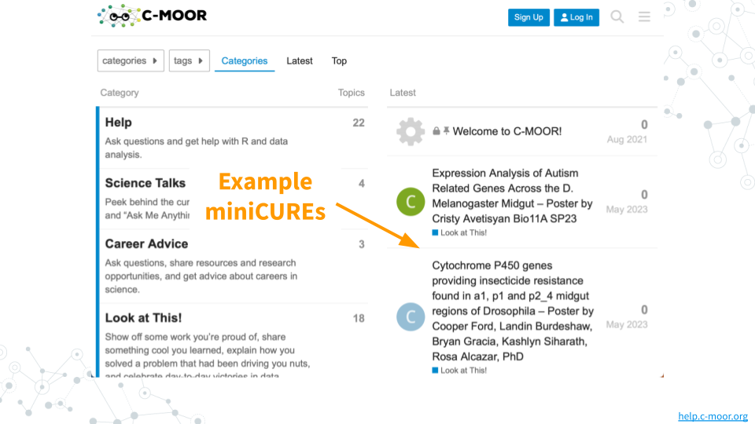
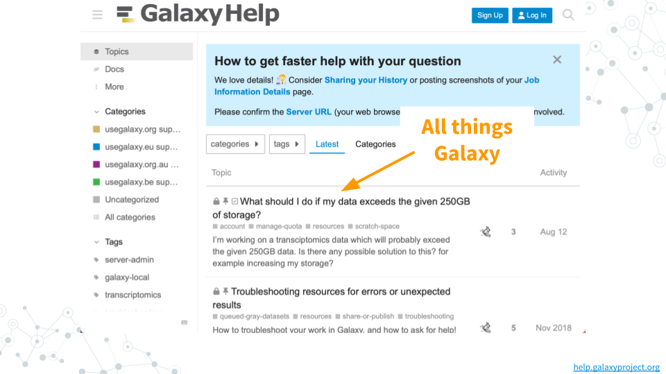
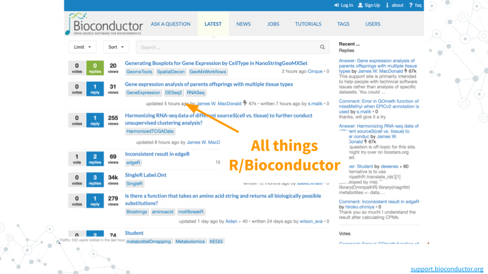
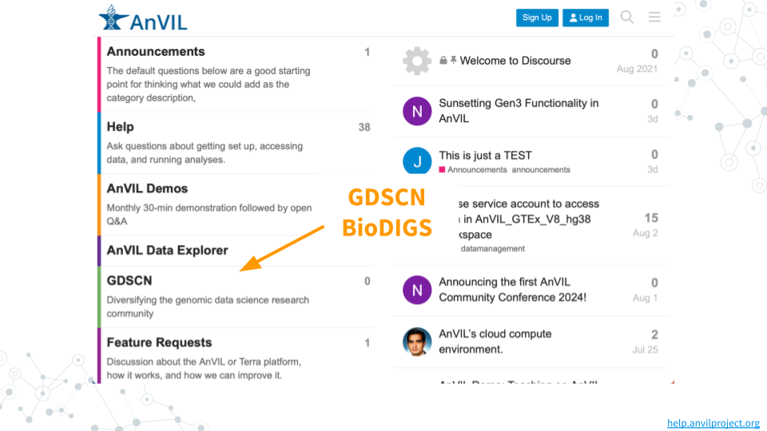

# (PART\*) APPENDIX {-}

# C-MOOR Scholars

Share your interests via C-MOOR Scholars Interest Form and learn how C-MOOR community can support you.

- [https://docs.google.com/forms/d/1GJDpfG28k2utCVVcRXQraE-1coLS_GCX83irUyio9KE/edit](https://docs.google.com/forms/d/1GJDpfG28k2utCVVcRXQraE-1coLS_GCX83irUyio9KE/edit)

Meet the C-MOOR Scholars and learn how you can support them

- [https://www.cloviscollege.edu/alumni-and-community/c-moor/c-moor-scholars.html](https://www.cloviscollege.edu/alumni-and-community/c-moor/c-moor-scholars.html)

# Online Community

The genomic data science community is a remarkably open community that continually strives to increase opportunitites and broaden access to the scientific enterprise (e.g. [GDSCN 2022](https://pubmed.gov/35858750){target="_blank"}).
There are many opportunities to interact online with scientists that share a common research question, career stage, or even favorite tool!
Below is a sampling of some discussion forums that you may find useful:

- [help.c-moor.org](https://help.c-moor.org){target="_blank"} for help with and example miniCUREs
- [help.galaxyproject.org](https://help.galaxyproject.org){target="_blank"} for all things Galaxy
- [support.bioconductor.org](https://support.bioconductor.org){target="_blank"} for all things R/Bioconductor
- [help.anvilproject.org](https://help.anvilproject.org){target="_blank"} for interactions with the GDSCN BioDIGS consotrium

