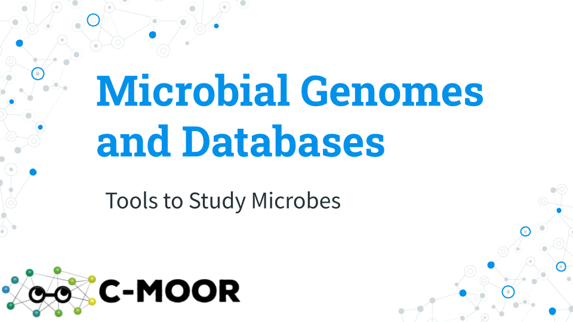

# Microbial Genomes

## Lecture: Microbial Genome

[Slides: Microbial Genomes](https://docs.google.com/presentation/d/1bnFhIIu6ZXSCjlrz5qWc7BZNz-7VfYWkKgbz3kL-ZNU/edit?usp=sharing)

## Homework: Microbial Genomes Prelab

## Homework: QC and Galaxy Workflows

### Introduction

In the “A short introduction to Galaxy” activity you learned how to upload a file, use a tool, view results, view histories, extract and run a workflow, and share a history.  You will now practice using these skills to do one of the first things when encountering a new sequencing dataset – quality control (QC).  After assessing the quality of both short and long reads, gain more practice with workflows by creating and editing a new workflow.

### Activity 1 – Quality Control (QC)

*Estimated time: 90 min*

#### Instructions

1. Complete the “Quality Control” hands-on tutorial: [training.galaxyproject.org/training-material/topics/sequence-analysis/tutorials/quality-control/tutorial](https://training.galaxyproject.org/training-material/topics/sequence-analysis/tutorials/quality-control/tutorial.html)

- **NOTE**: Do all hands-on steps in a single Galaxy history

### Activity 2 – Creating, Editing and Importing Galaxy Workflows

*Estimated time: 30 min*

#### Instructions

1. Complete the “Creating, Editing and Importing Galaxy Workflows” hands-on tutorial: [training.galaxyproject.org/training-material/topics/galaxy-interface/tutorials/workflow-editor/tutorial](https://training.galaxyproject.org/training-material/topics/galaxy-interface/tutorials/workflow-editor/tutorial.html)

### Grading Criteria

- Submit URL to your shared Galaxy “Quality Control” history on Canvas

### Footnotes

**Resources**

- Using Galaxy and Managing your Data [topic](https://training.galaxyproject.org/training-material/topics/galaxy-interface/)
- Introduction to Galaxy and Sequence analysis [pathway](https://training.galaxyproject.org/training-material/learning-pathways/intro-to-galaxy-and-genomics.html)

**Contributions and Affiliations**

- Frederick Tan, Johns Hopkins University

Last Revised: February 2025

## Discussion: Microbial Genomes Prelab

## Homework: Microbial Genomes Project

## Activity: test-driveR

## Presentation: Microbial Genomes Project
