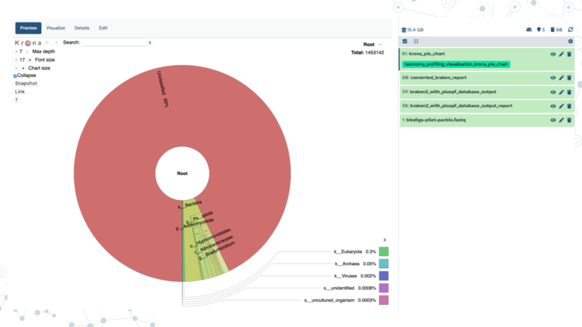

# (PART\*) Testing Ideas {-}

# Taxonomy Profiling

## Activity: Taxonomy Profiling Spreadsheet

### Purpose

First hands-on experience with real data!  Compare kraken2 output for [Zymo Gut Microbiome Standard](https://www.zymoresearch.com/products/zymobiomics-gut-microbiome-standard?srsltid=AfmBOoqP_zq131c2GTidPCM0j6yA3JFcGQ0haUNu1jAJI9RQ9qsXLYSF) and [Zymo Human Fecal Reference](https://files.zymoresearch.com/protocols/d6323-zymobiomics_fecal_reference_protocol.pdf).  Introduce concepts of taxa and relationships, begin forming data analysis goals like comparing how many species, most abundant species, etc. See accompanying [slides](http://docs.google.com/presentation/d/16lpgWFU6jzh-e7HuwXLHmUFpsnE8NreMzL-nTn8cJVk).

### Learning Objectives

1. Explore taxonomy with Kraken 2 taxonomic assignment output.
2. Compare and contrast taxonomy between Zymo Gut Microbiome Standard and Zymo Human Fecal Reference.

### Introduction

Metagenomics is the direct analysis of the genomes through genome sequencing of an environmental sample (soil, water, gut, etc). The purpose of the taxonomic classification of metagenomic sequences is to catalogue, classify and  identify the species inhabiting a given environment. In the process, new species may get identified! After sampling, DNA extraction, DNA sequencing and genome assembly, genome annotation is used to assign taxonomy to the sequenced sample DNA. Here is where the Kraken 2 tool comes in; Kraken 2 is a taxonomic classification tool which assigns taxonomy to sequencing reads.

### Activity 1 – Explore Zymo Gut Standard Metagenomic Diversity

*Estimated time: 25 min*

#### Instructions

Perform the activity below and answer the embedded **questions**.

1. Access tax-data-gut.tsv and open with Google Sheets [here](http://drive.google.com/file/d/1vL6adVIrqxpONbae8rUsneK3tbdCpmR-)

2. Identify what information is provided in columns of the tax-data-gut taxonomy file.

- Col A = Counts

- Cols B-H correspond to taxonomic ranks k(Kingdom), p(Phylum), c(Class), o(Order), f(Family), g(Genus) and s(Species)

- Each row corresponds to a different taxa. There are 153 taxa that were classified for this sample.

3. Create a header row and enter column information.

#### Questions

**1. Evaluate what proportion of data was taxonomically classified.**

 - Insert a new column A; we will use this temporary column for calculations, so you can name this column “Calculations”.

 - In e.g. cell A2, calculate the sum of all reads observed in the gut std sample.  

| 1A. How many total counts are there? |
|:--|
|   |
 

- In e.g. cell A3, determine the percentage of unclassified reads.

|1B.  What percentage of reads are unclassified? |
|:--|
|   |
 

- In e.g. cell A4, determine the percentage of classified reads.

| 1C. What percentage of reads are classified? |
|:--|
| |
 

**2. Identify abundant taxa (those at >1%).**

a. Select columns B through I
b. In the Data menu, select “Sort range by column B (Z to A)”
c. Insert a new column C; we will use this temporary column for calculations; you can name this column “% abundance”.
d. In new column C, calculate % abundance for each row by dividing each count value by the total number of reads and multiplying by 100.
e. Quantify abundant taxa.

| 2A. How many abundant taxa (at >1%) do you observe? |
|:--|
| |
 

3. List abundant taxa you identified in a table below.

- To consolidate the different abundant taxa, in e.g. new column D, copy the lower taxonomic rank identified for the abundant (at >1%) taxa.
- Then, enter the results into a table below.

|3A. What abundant taxa do you observe?| |
|:--|:--| 
| **% abundance** | **Taxonomy** |
| 20.1 | s_Faecalibacterium_prausnitzii |
| | |
| | |
| | |
| | |
| | |
| | |
| | |
| | |
| | |
| | |
| | |
| | |
| | |
| | |

 

**4. Compare your results with the expected taxa and abundance for [Zymo gut standard documentation](https://www.zymoresearch.com/products/zymobiomics-gut-microbiome-standard?srsltid=AfmBOor0X27Jf1gfXVmyGu5nZq3M6fx6OJXdEc0t6rqSRBPww2qeY-Yd)?**

- Note, the Kraken2 output does not distinguish different *E. coli* strains, so just combine them all into a single *E. coli group*!

| 4A. How do your results overall compare with the expected taxa and % abundance from Zymo gut standard? |
|:--|
| |
 

|5. Calculate ‘Low abundance’ for < 1% abundant taxa by adding together taxa at <1%. What percentage of reads are classified in a low abundance taxa?|
|:--|
| |
 

|6. Create a barplot of % abundance for your 12 abundant taxa via Insert Chart. Paste your barplot of % abundance for the 12 most abundant taxa.|
|:--|
| |
 

### Activity 2 (OPTIONAL) – Compare with Zymo Fecal Reference

*Estimated time: 20 min*

#### Instructions

Perform the optional activity below and answer the embedded **questions**.

In this activity, repeat steps of the Activity 1 above, but now using [tax_data_fecal.tsv](http://drive.google.com/file/d/1CLQw9yqoqWl5caLm-ZmiHpLNtUo_Zo4s) dataset corresponding to Zymo fecal reference. The tax_data_fecal.tsv dataset comes from a real human fecal sample, in contrast to the tax_data_gut.tsv sample you explored in the Activity 1, which corresponds to cultured and pooled known species combined at specific proportions to make up a predictable standard population.

- Perform Activity 1 exercises using tax_data_fecal data, then, use questions below to compare the two datasets.
- See D6323 Zymo Fecal Microbiome References documentation (pg. 4) in the Resources section below.

#### Questions

|**1. Which dataset is classified better, gut or fecal??**|
|:--|
| |

|**2. Are there any abundant taxa (at >1%) in common between the gut standard and fecal reference?**|
|:--|
| |

|**3. In your opinion, does the gut standard mimic the fecal reference well or not?**|
|:--|
| |

### Grading Criteria

- Download this assignment as Microsoft Word (.docx) and upload on Canvas
- Download your Google Sheet as Microsoft Excel (.xlsx) and upload on Canvas

### Footnotes

**Resources**

- Google Doc
- [D6331 Zymo Gut Microbiome Standard documentation](https://www.zymoresearch.com/products/zymobiomics-gut-microbiome-standard?srsltid=AfmBOor0X27Jf1gfXVmyGu5nZq3M6fx6OJXdEc0t6rqSRBPww2qeY-Yd)
- [D6323 Zymo Fecal Microbiome References documentation](https://files.zymoresearch.com/protocols/d6323-zymobiomics_fecal_reference_protocol.pdf?_gl=1*cych1b*_gcl_au*MzEzNzgzNjc0LjE3MzQ5NTk3NzY)

**Contributions and Affiliations**

- Valeriya Gaysinskaya, Johns Hopkins University
- Gauri Paul, Clovis Community College
- Frederick Tan, Johns Hopkins University

Last Revised: January 2025

## Lecture: Taxonomy Profiling

[Slides: Taxonomy Profiling](https://docs.google.com/presentation/d/10P4ktKWSrRpM1YAWYW31tLly_jf1rcfgCMbzZ9Tx9xY/edit?usp=sharing)

## Prelab: Taxonomy Profiling

### Purpose

To use a variety of Galaxy tools to perform Quality Control (QC), taxonomy profiling, and visualization of a metagenomics sample.

### Learning Objectives

Use Galaxy tools to:

1. Perform Quality Control (QC) on your raw data by checking the quality of your raw reads
2. Assign taxonomy labels to your reads
3. Visualize the classified metagenome

In this exercise, using Galaxy, you will be:

1. Using NanoPlot tool to examine the quality of your sequencing reads
2. Running a workflow to perform taxonomy profiling and visualization in a single step

### Introduction

To find out which microorganisms are present in the sample, it is important to have high-quality DNA sequences. To ensure high-quality sequence input, QC (and in many cases also read trimming and filtering) are routinely performed on raw sequences. The reads can then be used to determine which species, genera, families, and other taxonomic ranks are present in the sample. To assign taxonomy, we can compare the reads of the sample to a reference database, i.e. sequences of known microorganisms stored in a database, using Kraken2, which is a k-mer based taxonomic assignment tool. We can then use a tool like Krona to interactively visualize and explore the composition of a metagenome.  

### Activity 1 – QC Reads

*Estimated time: 50 min*

#### Activity 1 - Part I: Import dataset into Galaxy

*Estimated time: 15 min*

#### Instructions

1. Import dataset into Galaxy. 

a. Open the zymo-gut-standard public history [https://usegalaxy.org/u/valerie-g/h/zymo-gut-standard-d6331-subset-1](https://usegalaxy.org/u/valerie-g/h/zymo-gut-standard-d6331-subset-1) 

b. Click on **Import this history**, select Copy only the active, non-deleted datasets and then Copy History. 

c. Confirm <mark style="background color:green">Zymo_Gut_Standard_D6331_subset</mark> exists in your history by clicking on the Home button "Galaxy" on top left ().

d. Click on Zymo_Gut_Standard_D6331_subset to explore content.

#### Questions

|1. What is the size of this downloaded dataset subset?|
|:--|
| |
<break>

|2. What is the format/extension of the downloaded file?|
|:--|
| |
<break>

|3. Click on the Display (eyeball) icon and describe what you see in the 4 lines of the fastq file?| 
|:--|
|Line 1:| 
|Line 2:| 
|Line 3:| 
|Line 4:| 
<break>

#### Activity 1 - Part II: Run Nanoplot in Galaxy to assess sequence quality

*Estimated time: 15 min*

#### Instructions

1. Run Nanoplot in Galaxy. 

a) Explore NanoPlot tool parameters - click on the Tools icon on the left of the page. Then, in the search bar enter ‘NanoPlot’ and select the **NanoPlot** tool. Explore NanoPlot functionality via examining **Tool Parameters**.

b) Run NanoPlot using default settings. Under Tool Parameters, **check the following settings**:

- Under **files** there are 4 options to select a fastq dataset: Single dataset, Multiple datasets, Dataset collection or option '...' which is Browse or Upload Datasets. Browse to select your fastq dataset. **Note**, Galaxy tool may pre-select the correct dataset already for you so just make sure that the file is correct. 

- Click on Run Tool and wait ~5-10 minutes as the NanoPlot job is scheduled, run, and complete.

#### Questions

|1. Under **Type of file(s) to work on**, check to see which input files are compatible with NanoPlot and name 2 file extension options listed.|
|:--|
|File extension name 1:| 
|File extension name 2:| 
 

|2. Click to expand *Options for filtering or transforming input prior to plotting* and name 3 options you could use to filter your sequencing data.|
|:--|
|1.| 
|2.| 
|3.| 
  

| 3. <mark style="background color:yellow">**Run Nanoplot**</mark> using default tool settings and record how many output files you obtained after running NanoPlot and list their names.| 
|:--|
| # of output files|
| Names of output files|
   

#### Activity 1 - Part III: View NanoPlot Results in Galaxy

*Estimated time: 15 min*

#### Instructions 

1. View and examine NanoPlot Results in Galaxy. 

- By clicking on the Display icon (eyeball) next to the NanoPlot output.

#### Questions

1. Click on the Display icon (eyeball) next to the NanoPlot output files to view results.

| A. How many bases were sequenced?| 
|:--|
| |
 

| B. Why is mean read length longer than the median read length? - Hint: think skewness https://wikipedia.org/wiki/Skewness|
|:--|
| |
 

| C. Record Reads >Q20 metric value. Given that Q20 quality (Phred) score corresponds to read accuracy of 99% (or 1 in 100 errors), do you think this dataset is of a good sequence quality?|
|:--|
| |
 

2. Click on the Display icon (eyeball) next to the NanoPlot output HTML report. 

| A. Scroll down to view the ‘Weighted histogram of read lengths’ histogram. From this plot estimate the range of read lengths obtained| 
|:--|
| |
 

| B. Scroll down to view the ‘Yield by length’ cumulative plot which shows sequencing yield based on read length. From this plot do shorter (10kb or less) or longer sequences produce more data?| 
|:--|
| |
 

### Activity 2 – Taxonomy Profiling in Galaxy

*Estimated time: 50 min*

#### Activity 2 - Part I: Run ‘Taxonomy Profiling’ workflow in Galaxy

*Estimated time: 15 min*

#### Instructions

1.  Run ‘Taxonomy Profiling’ public workflow.

a. Open the taxonomy-profiling public workflow [https://usegalaxy.org/u/cutsort/w/taxonomy-profiling](https://usegalaxy.org/u/cutsort/w/taxonomy-profiling) and click on **Run**. 

b. Browse to select your fastq dataset by clicking on the ‘...’ tab.

c. Under **kraken_database** select <mark style="background color: green">‘Prebuilt Refseq indexes: PlusPF(Standard plus protozoa and fungi)(Version:2022-06-07 - Downloaded: 2022-09-04T165121Z).

d. Click **Run Workflow** with the following parameters:

e. Wait ~15-30 minutes as the Kraken2, KrakenTools, and Krona jobs are scheduled, run, and complete.

2. Examine select aspects of Kraken2 tool. 

a) While the Taxonomy Workflow is running, click on the Tools icon on the left of the page. 

b) Then, in the search bar enter ‘Kraken2’’ and select the **Kraken2** tool. 

#### Questions

| A. How  does Galaxy describe the Kraken2 tool in its descriptor on top of the page?| 
|:--|
| |
 

| B. Scroll down to **Help/What it does** section, and in your own words paraphrase the paragraph describing how Kraken 2 works.| 
|:--|
| |
 

| C. Record how many output files you obtained from the Taxonomy Workflow and list their names.| 
|:--|
| |
 

#### Activity 2 - Part II: View Kraken2 results

*Estimated time: 15 min*

#### Instructions

1. <mark style="background color: grey">Examine **converted_kraken_report**.

- Click on the Display icon (eyeball) next to the output file with **converted_kraken_report**. This report should look familiar from week 1 taxonomy-profiling-spreadsheet activity. 

#### Questions

1. Open and scroll through the **converted_kraken_report** report to answer the following questions: 

| A. How many Unclassified reads are there?| 
|:--|
| |
 

| B. How many Kingdoms are there and what are they?| 
|:--|
| |
 

| C. How many Phyla are there and what are they?| 
|:--|
| |
 

| D. Using the total *number_of_reads* you obtained from the **NanoStats** (NanoPlot) metrics, and the value of *Unclassified* reads from the **converted_kraken_report**, calculate % unclassified and % classified taxa.| 
|:--|
| |
 

| E. Click on the **converted_kraken_report** entry and just below the ‘Add Tags’ to see the number of lines and columns in the file. The number of lines corresponds to the number of taxa detected. Excluding Unclassified subset, how many taxa were identified?| 
|:--|
| |
 

2. Examine **kraken2_with_pluspf_database_output_report** by clicking on the Display icon (eyeball) next to the output file.

This output report is an extended version of the converted_kraken_report. The output contains 6 columns. See info for select column headers below:

- Column 1: Percentage (%) of a given taxon
- Column 2: # of reads per given taxon
- Column 4: A rank code, indicating (U)nclassified, (R)oot, (D)omain, (K)ingdom, (P)hylum, (C)lass, (O)rder, (F)amily, (G)enus, or (S)pecies. Note, that in this extended file, some rank codes will have numbers associated with them; Ignore this aspect of the document for the moment.
- Column  6: Identified taxa/scientific name.

| A. What is the percentage of Unclassified taxa listed? Does it match what you calculated in section 2-2.1?| 
|:--|
| |
 

| B. What is the percentage of Classified taxa listed? Does it match what you calculated in section 2-2.1?| 
|:--|
| |
 

| C. Find and record the 3 most abundant Phyla (p_) by percentages.  As rows are not sorted by abundance, you may find it helpful to search using for “P” using <CTRL>-F to highlight rows corresponding to phyla.| 
|:--|
| |
 

3. View Krona Results

Krona pie chart is one of the outputs of the Taxonomy workflow, and it is an interactive visualization tool for exploring the composition of metagenomes. Click on Display icon (eyeball) next to the **Krona_pie_chart** dataset to explore Krona pie chart results. 

| A. What are the 2 main phyla you observe?| 
|:--|
| |
 

| B. What appears to be the more diverse phyla of the two and why?| 
|:--|
| |
 

| C. Examine how many reads and percent of reads classified as phylum Firmicutes.| 
|:--|
| |
 

| D. What is one of the most abundant Orders in phylum FIrmicutes based on number and % of reads?| 
|:--|
| |
 

| E. Within the most abundant Order from your answer above, record one Family member, one genus member and one species member; also include percent abundances.| 
|:--|
| |
 

| F. Some potentially pathogenic bacterial species are often present in a healthy gut, but at relatively low amounts. What % of bacteria is represented by *C. difficile* (*Clostridiodes difficile*) in this gut standard sample? How does it compare to the expected proportion in [ZymoBIOMICS® Gut Microbiome Standard](https://files.zymoresearch.com/datasheets/ds1712_zymobiomics_gut_microbiome_standard_data_sheet.pdf?_gl=1*1njkhlx*_gcl_au*MzE1NTQwNzEuMTczODI1OTA5OA..)?| 
|:--|
| |
 

### Grading Criteria

- <mark style="background color: yellow">Download as Microsoft Word (.docx) and upload on Canvas

### Footnotes

**Resources**

- Google Doc
- Species composition in the Gut Microbiome Standard dataset: [ZymoBIOMICS® Gut Microbiome Standard](https://files.zymoresearch.com/datasheets/ds1712_zymobiomics_gut_microbiome_standard_data_sheet.pdf?_gl=1*1njkhlx*_gcl_au*MzE1NTQwNzEuMTczODI1OTA5OA..)
- If interested reading more about Kraken 2, see [Kraken 2 publication](https://pubmed.gov/31779668)

**Contributions and Affiliations**

- Valeriya Gaysinskaya, Johns Hopkins University
- Frederick Tan, Johns Hopkins University

Last Revised: May 2025

## Discussion: Taxonomy Profiling

### Activity

*Estimated time: 25 min*

#### Instructions

1. Form new groups of four
- [https://docs.google.com/spreadsheets/d/11eoJgm9mehxGWWzh8IZYDCDmnCmSyshopPYHewvpC8c/edit?usp=sharing](https://docs.google.com/spreadsheets/d/11eoJgm9mehxGWWzh8IZYDCDmnCmSyshopPYHewvpC8c/edit?usp=sharing)

2. Pair up into groups (10 min)

a. Discuss -- Each group member briefly describes answers to prelab assignment

b. Summarize -- Identify best answer and add to slidedeck

- [https://docs.google.com/presentation/d/16cRBFzezun6MGXcJEm5uP2KercIccO-dFvVx58_ClNo/edit?usp=sharing](https://docs.google.com/presentation/d/16cRBFzezun6MGXcJEm5uP2KercIccO-dFvVx58_ClNo/edit?usp=sharing)

3. Share group discussion (2 min each group)

### Footnotes

**Contributions and Affiliations**

- Valeriya Gaysinskaya, Johns Hopkins University
- Frederick Tan, Johns Hopkins University

Last Revised: February 2025

## Project: Taxonomy Profiling

### Purpose

To use a variety of Galaxy tools to perform Quality Control (QC), sequence quality filtering, taxonomy profiling, and visualization of a metagenomics soil sample sequenced with long-read Nanopore technology.

### Learning Objectives

In this exercise, using Galaxy tools you will be
1. Performing QC and quality filtering of your soil metagenomics data with NanoPlot and fastp tools.
2. Running a workflow to perform taxonomy profiling and visualization of a soil metagenome.

Throughout these objectives you will be comparing soil and gut metagenomes.

### Introduction 

The total time for a Galaxy step to complete depends on and will increase based on multiple factors such as large input file size, long queue when many other people are analyzing data, the complexity of the job itself, or an error. See table below for the minimum time a step will take for this assignment – be sure to start early as when Galaxy is busy each step can take 2-to-10 times longer to complete. 
 

Note, that you can save time by 1) submitting multiple jobs that use the same input (NanoPlot and fastp) and 2) submitting a job like the taxonomy workflow that uses the fastp output as input as soon as the output appears in your history even before the fastp job finishes.

**Table of approximate minimum times for a job to be completed on Galaxy using specified tools.**

|Nanoplot| fastp | taxonomy workflow |
|:--|:--|:--|
|15 min| 15 min | 30 min | 
 

### Activity 1 – QC 

*Estimated time: 50 min*

#### Activity 1 - Part I: Import data and run NanoPlot 

#### Instructions

1. Import dataset into Galaxy. 

a. Open the nanopore-soil-pilot public history [https://usegalaxy.org/u/valerie-g/h/nanopore-soil-pilot-1](https://usegalaxy.org/u/valerie-g/h/nanopore-soil-pilot-1)

b. Click on `Import this history`, select Copy only the active, non-deleted datasets and then Copy History. 

c. Confirm <mark style="background color: green">Nanopore-soil-pilot-subset</mark> exists in your history by clicking on the Home button on top left ().

2. Run **NanoPlot** tool in Galaxy to assess sequence quality using **default settings**.

a. Click on the Tools icon. Then, in the search bar enter ‘NanoPlot’ and select the NanoPlot tool. 

b. Under **files** browse to select your Nanopore-soil-pilot-subset fastq dataset.

c. Click on **Run Tool** and wait ~10 minutes as the NanoPlot job is scheduled, run, and complete.

#### Questions

|1.  Click on the Display icon (eyeball) next to the NanoPlot output NanoStats report and record:|
|:--|
|Read mean length (mean read length):|
|Read Mean quality (mean_qual):|
|Proportion of reads with quality > Q20 (Reads > Q20):|
 

**2.  Compare NanoPlot results.**

| | Nanopore soil pilot (this activity) | Zymo gut standard (taxonomy profiling pre-lab) |
|:---|:---|:---|
| mean read length:|  |  |
| mean_qual:|  |  |
| Reads > Q20:|  |  |
 

|3. Which dataset has better sequence quality, Zymo-gut-standard (taxonomy profiling pre-lab) or Nanopore-soil pilot (taxonomy profiling project)? Why?|
|:---|
| | 
 

#### Activity 1 - Part II: Quality filtering with fastp

#### Instructions

Although the majority of bases in the soil dataset are of high quality ( >Q20, or 1 in 100 base error), we can filter out very low quality reads to further improve dataset quality. In this activity run fastp tool to filter out reads with a high proportion of low quality bases (<Q15) using default settings.

a. Click on the Tools icon. Then, in the search bar enter **fastp** and select the fastp tool. 

b. Click on **Run Tool** and wait ~10 minutes as the fastp job is scheduled, run, and complete. 

#### Questions

**1.  Compare your dataset before and after filtering using fastp: HTML report output.**

| | **Before** | **After**|
|:--|:--|:--|
|Mean Length| | |
|total reads| | |
|total bases|  | |
|Q20 bases (%):|  | |
|Q30 bases (%):|  | |
 

|2. Compare BEFORE and AFTER quality plots from activity above. What key quality improvement can you observe after fastp quality filtering. `Hint 1`: look at 5’ end, 3’ end and the middle? `Hint 2`: Pay attention to the y-axis|
|:--|
| | 
 

### Activity 2 – Taxonomy Profiling

*Estimated time: 50 min (~35 min computing)*

#### Activity 2 - Part I: Run Taxonomy Profiling Workflow

#### Instructions

1. Run ‘Taxonomy Profiling’ workflow on your fastp-filtered data from Activity 1 and view results.

a. Open the taxonomy-profiling public workflow [https://usegalaxy.org/u/cutsort/w/taxonomy-profiling](https://usegalaxy.org/u/cutsort/w/taxonomy-profiling)

b. Click on Run 

c. Browse to select your fastp-filtered fastq dataset <mark style="background color: green">“fastp on data1:Read 1 output”</mark> dataset by clicking on the `‘...’` tab.

d. Under **kraken_database** select <mark style="background color: green">‘Prebuilt Refseq indexes: PlusPF(Standard plus protozoa and fungi)(Version:2022-06-07 - Downloaded: 2022-09-04T165121Z).

d. Click **Run Workflow**

3. Wait ~15-30 minutes as the Kraken2, KrakenTools, and Krona jobs are scheduled, run, and complete.

2. Click on the Display icon (eyeball) next to the output file with converted_kraken_report. Explore metagenomic diversity of soil by performing taxonomy profiling spreadsheet activity you did during week 1. 

a. Click on **converted_kraken_report**, find the download button and **download** the report.

b. <mark style="background color: yellow">Change the extension of your taxonomy file from .tabular to .tsv.

c. Upload your taxonomy .tsv file to Google Drive and open with Google Sheets.

d. Create a header row and enter column Information.

- Col A = Counts
- Cols B-H correspond to taxonomic ranks k(Kingdom), p(Phylum), c(Class), o(Order), f(Family), g(Genus) and s(Species).
- Each row corresponds to a different taxa. 

e. Evaluate what proportion of data was taxonomically classified.
- Insert a new column A; we will use this temporary column for calculations, so you can name this column “Calculations”.
- In e.g. cell A2, calculate the sum of all reads observed in the soil  sample. 

#### Questions

|1. How many total read counts are there?|
|:---|
||
 

|2. Determine percentage of reads that are unclassified| 
|:---|
||
 

|3. What percentage of reads are classified?| 
|:---|
||
 

**4. Identify the most abundant taxa (those at >0.1%).**
- Remember, soil is one of the most diverse microbial environments with many more microbial species than in the gut. Therefore, abundant species can still be quite low abundance.

a. Select columns B through I

b. In the Data menu, select “Sort range by column B (Z to A)”

c. Insert a new column C; we will use this temporary column for calculations; you can name this column “% abundance”.

d. In new column C, calculate % abundance for each row by dividing each count value by the total number of reads and multiplying by 100.

|How many ‘abundant' taxa (at > 0.1%) do you observe?|
|:---|
||
 

|5. What are the taxonomic ranks of most abundant taxa?| 
|:---|
||
 

|6. What is the most abundant eukaryote observed and its read count?| 
|:---|
||
 

|7. What is the most abundant archaea observed and its read count?| 
|:---|
||
 

|8. What is the most abundant virus observed and its read count?| 
|:---|
||
 

#### Activity 2 - Part II: Analyze Kraken2 results

#### Instructions

1. Click on the Display icon (eyeball) next to the output file with **kraken2_with_pluspf_database_output_report**. This output report is an extended version of the converted_kraken_report. The output contains 6 columns. See info for select column headers below:

- Column 1: Percentage (%) of a given taxon
- Column 2: # of reads per given taxon
- Column 4: A rank code, indicating (U)nclassified, (R)oot, (D)omain, (K)ingdom, (P)hylum, (C)lass, (O)rder, (F)amily, (G)enus, or (S)pecies. Note, that in this extended file, some rank codes will have numbers associated with them; Ignore this aspect of the document for the moment.
- Column  6: Identified taxa/scientific name.
 

`Of note`: The benefit of kraken2_with_pluspf_database_output_report is that it summarizes converted_kraken_report and calculates summary percentages for taxonomic ranks. For example, your converted_kraken_report has hundreds of lines for phylum Proteobacteria, while kraken2_with_pluspf_database_output_report has 1 line summarizing the percent abundance of all Proteobacteria.

#### Questions

|1. What is the percentage of Unclassified taxa? Does it match your calculations in Activity 2 - Part I?| 
|:---|
||
 

|2. What percentage of bacteria is Proteobacteria, the most abundant Phyla observed?|
|:---|
||

|3. What is the most abundant class observed and at what percentage?|
|:---|
||
 

#### Activity 2 - Part III: Krona Pie Chart

#### Instructions

Krona pie chart is one of the outputs of the Taxonomy workflow, and it is an interactive visualization tool for exploring the composition of metagenomes.

a. View Krona results: Click on the Display icon (eyeball) next to the output file named **krona_pie_chart**. 
b. Double click on Bacteria kingdom (k_Bacteria) to explore further.
c. Answer questions below

#### Questions

|1. What are the 2 main phyla you observe?|
|:---|
||
 

|2. What appears to be the more diverse phyla of the two?|
|:---|
||
 

**3. Compare your taxonomy from soil, to the gut taxonomy results from your taxonomy-prelab** (Zymo-gut-standard [ZymoBIOMICS® Gut Microbiome Standard](https://files.zymoresearch.com/datasheets/ds1712_zymobiomics_gut_microbiome_standard_data_sheet.pdf?_gl=1*1njkhlx*_gcl_au*MzE1NTQwNzEuMTczODI1OTA5OA..).|

**3A. Fill out the comparison table below**

|| Nanopore soil pilot| Zymo gut standard|
|:---|:---|:---|
|What are 2 most abundant phyla| | |
|What are 2 most abundant species| | |
|% Classified taxa| | |
|% Unclassified taxa| | |
 

|3B. Discuss taxonomy diversity between soil and gut, providing 3 points:| 
|:---|
| 1) |
| 2) |
| 3) | 
 

### Grading Criteria

- <mark style="background color: yellow">Download as Microsoft Word (.docx) and upload on Canvas

### Footnotes

**Resources**
- Google Doc
- Species composition in the Gut Microbiome Standard dataset: [ZymoBIOMICS® Gut Microbiome Standard](https://files.zymoresearch.com/datasheets/ds1712_zymobiomics_gut_microbiome_standard_data_sheet.pdf?_gl=1*1njkhlx*_gcl_au*MzE1NTQwNzEuMTczODI1OTA5OA..)

**Contributions and Affiliations**

- Valeriya Gaysinskaya, Johns Hopkins University
- Frederick Tan, Johns Hopkins University

Last Revised: May 2025

## Presentation: Taxonomy Profiling

### Activity

*Estimated time: 25 min*

### Instructions

1. Open the “Taxonomy Profiling Presentation” slidedeck [https://docs.google.com/presentation/d/1qsGKQ3M-etSpH1JFN270YfYgtYKxCsE-ou2B7gw25Gc/edit?usp=sharing](https://docs.google.com/presentation/d/1qsGKQ3M-etSpH1JFN270YfYgtYKxCsE-ou2B7gw25Gc/edit?usp=sharing)

2. Create at least two slides (feel free to make more!) to present your findings e.g.
- Describe the sample, drawing inspiration from Fig 2 (taxonomic distribution) and Fig 3a (read abundance) in the Xue et al 2023 ballast water study
- Propose several steps for a follow-up analysis to compare this soil sample with one of the studies described in the Possible Dataset Activity, drawing inspiration from your submissions as well as those of your classmates in the Discussion Forum

3. Iterate your slides being sure to
- Add bullet points on key details you understand (Notice) and questions you have (Wonder)
- Include one or more plots or images that support your points
- Create slide titles that summarize your main takeaway

4. Present at next class (5 min each group)

### Footnotes

**Contributions and Affiliations**

- Valeriya Gaysinskaya, Johns Hopkins University
- Frederick Tan, Johns Hopkins University

Last Revised: February 2025

